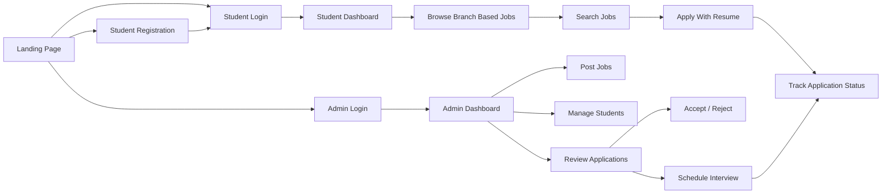
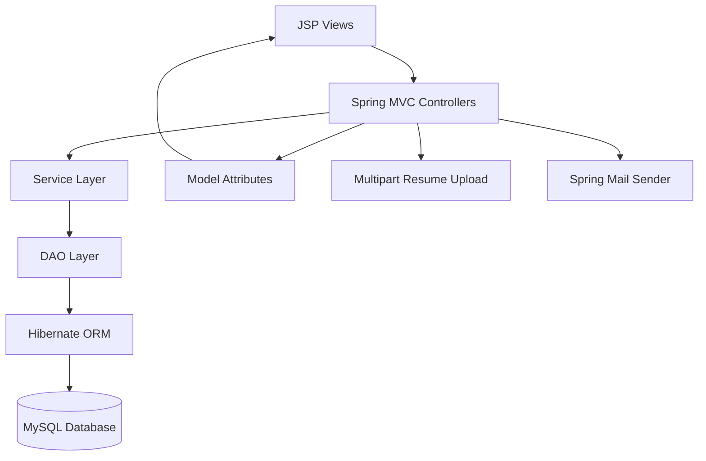

<p align="center">
  
</p>

<p align="center">
  
</p>

<p align="center">
  <a href="https://github.com/chetandhawas9/Placement_portal1">
    
  </a>
  
  
  
  
  
</p>

<p align="center">
  <b>A full-stack Java web application that digitizes campus recruitment by connecting students, placement administrators, job openings, applications, resume uploads, approvals, and interview scheduling in one centralized portal.</b>
</p>

<p align="center">
  <a href="#-project-overview">Overview</a> •
  <a href="#-key-features">Features</a> •
  <a href="#-tech-stack">Tech Stack</a> •
  <a href="#-project-flow">Flow</a> •
  <a href="#-installation--setup">Setup</a> •
  <a href="#-project-structure">Structure</a> •
  <a href="#-security-notes">Security</a>
</p>

---

## ✨ Project Overview

**Career Bridge - Placement Portal** is a Java-based campus placement management system built using **Spring MVC, Hibernate ORM, JSP, JSTL, MySQL, and Maven**.

The project is designed to reduce manual placement work by giving students and administrators a single platform for job discovery, applications, resume submission, application review, interview scheduling, and recruitment status tracking.

<table>
<tr>
<td width="50%">

### 🎓 Student Side

Students can register, login, view branch-based jobs, search openings, apply with resume upload, and track their application status.

</td>
<td width="50%">

### 🛡️ Admin Side

Admins can login, post jobs, manage students, review applications, accept/reject candidates, and schedule interviews.

</td>
</tr>
</table>

---

## 🚀 Key Features

### 👨‍🎓 Student Module

- Student registration and secure session-based login
- Branch-based job recommendations
- Job search by title/company/keyword
- Apply to jobs through a dedicated application form
- Resume upload support using multipart file handling
- CGPA, backlog, and cover letter submission
- Duplicate application prevention
- Personal dashboard with total jobs and applied job count
- Application status tracking
- Forgot password flow through registered email
- Logout and session invalidation

### 🛡️ Admin Module

- Admin registration and login
- Admin dashboard with platform overview
- Add new job opportunities
- Delete job postings
- View and search registered students
- Delete student records
- View all submitted applications
- Accept or reject applications
- Schedule interview date/time for candidates
- Track total students, jobs, and applications
- Tab-based dashboard navigation for better management

### 📄 Application Management

- Resume file upload
- Application status workflow:
  - `PENDING`
  - `ACCEPTED`
  - `REJECTED`
  - `INTERVIEW_SCHEDULED`
- Candidate details stored with every application
- Interview date storage
- Student-wise application history

---

## 🧰 Tech Stack

| Layer | Technology |
|---|---|
| Language | Java 11 |
| Backend Framework | Spring MVC 5.3.37 |
| ORM | Hibernate 5.6.15.Final |
| Database | MySQL |
| Frontend | JSP, JSTL, HTML, CSS, JavaScript |
| Build Tool | Maven |
| Packaging | WAR |
| Server | Apache Tomcat 9+ |
| File Upload | Commons FileUpload 1.5, Commons IO 2.15.1 |
| Email Service | Spring Mail, JavaMail |
| Servlet API | Java Servlet 4.0.1 |

---

## 🧭 Project Flow



---

## 🏗️ Architecture



---

## 🗂️ Main Modules

| Module | Responsibility |
|---|---|
| `MainController` | Student login, registration, dashboard, job application, resume upload, forgot password, logout |
| `AdminController` | Admin login, admin registration, dashboard, job posting, student management, application review, interview scheduling |
| `JobController` | Job search and branch-based job filtering |
| `StudentService` | Student business logic |
| `AdminService` | Admin authentication and registration logic |
| `JobService` | Job posting, search, delete, and branch filtering logic |
| `ApplicationService` | Job application, duplicate check, status update, and interview scheduling logic |
| `StudentDao` | Student database operations |
| `AdminDao` | Admin database operations |
| `JobDao` | Job database operations |
| `ApplicationDao` | Application database operations |

---

## 🧱 Database Models

| Entity | Table | Purpose |
|---|---|---|
| `StudentModel` | `student_profiles` | Stores student profile, login, contact, college, branch, and CGPA details |
| `AdminModel` | `admin_users` | Stores admin account and login details |
| `JobModel` | `jobs` | Stores job title, company, branch, minimum CGPA, description, location, deadline, and salary |
| `ApplicationModel` | `applications` | Stores job applications, resume path, status, interview date, and candidate academic details |
| `LoginModel` | Form model | Used for login form binding |

---

## 📌 Important Routes

### Student Routes

| Route | Method | Description |
|---|---:|---|
| `/` | GET | Redirects to student login |
| `/login` | GET | Opens student login page |
| `/loginProcess` | POST | Processes student login |
| `/register` | GET | Opens student registration page |
| `/registerProcess` | POST | Registers a new student |
| `/studentDashboard` | GET | Shows student dashboard, eligible jobs, and applications |
| `/jobs` | GET | Searches jobs by keyword/branch |
| `/jobApplication` | GET | Opens job application page |
| `/applyJobProcess` | POST | Submits job application with resume |
| `/forgotPassword` | GET | Opens forgot password page |
| `/forgotPasswordProcess` | POST | Sends login details to registered email |
| `/logout` | GET | Logs out the student |

### Admin Routes

| Route | Method | Description |
|---|---:|---|
| `/admin/login` | GET | Opens admin login page |
| `/admin/loginProcess` | POST | Processes admin login |
| `/admin/register` | GET | Opens admin registration page |
| `/admin/registerProcess` | POST | Registers a new admin |
| `/admin/dashboard` | GET | Opens admin dashboard |
| `/admin/addJob` | POST | Adds a new job |
| `/admin/deleteJob?id={id}` | GET | Deletes a job |
| `/admin/deleteStudent?id={id}` | GET | Deletes a student |
| `/admin/updateAppStatus?appId={id}&status={status}` | GET | Updates application status |
| `/admin/scheduleInterview` | POST | Schedules interview date |
| `/admin/logout` | GET | Logs out the admin |

---

## 📁 Project Structure

```bash
Placement_portal1/
└── placementPortal/
    ├── pom.xml
    ├── src/
    │   ├── main/
    │   │   ├── java/
    │   │   │   └── com/
    │   │   │       ├── controller/
    │   │   │       │   ├── AdminController.java
    │   │   │       │   ├── JobController.java
    │   │   │       │   └── MainController.java
    │   │   │       ├── MainDao/
    │   │   │       │   ├── AdminDao.java
    │   │   │       │   ├── ApplicationDao.java
    │   │   │       │   ├── JobDao.java
    │   │   │       │   └── StudentDao.java
    │   │   │       ├── MainDaoImpl/
    │   │   │       │   ├── AdminDaoImpl.java
    │   │   │       │   ├── ApplicationDaoImpl.java
    │   │   │       │   ├── JobDaoImpl.java
    │   │   │       │   └── StudentDaoImpl.java
    │   │   │       ├── model/
    │   │   │       │   ├── AdminModel.java
    │   │   │       │   ├── ApplicationModel.java
    │   │   │       │   ├── JobModel.java
    │   │   │       │   ├── LoginModel.java
    │   │   │       │   └── StudentModel.java
    │   │   │       ├── service/
    │   │   │       │   ├── AdminService.java
    │   │   │       │   ├── ApplicationService.java
    │   │   │       │   ├── JobService.java
    │   │   │       │   └── StudentService.java
    │   │   │       └── serviceimpl/
    │   │   │           ├── AdminServiceImpl.java
    │   │   │           ├── ApplicationServiceImpl.java
    │   │   │           ├── JobServiceImpl.java
    │   │   │           └── StudentServiceImpl.java
    │   │   └── webapp/
    │   │       ├── index.jsp
    │   │       └── WEB-INF/
    │   │           ├── spring-servlet.xml
    │   │           ├── web.xml
    │   │           └── view/
    │   │               ├── AdminDashboard.jsp
    │   │               ├── AdminLogin.jsp
    │   │               ├── AdminReg.jsp
    │   │               ├── StudDashboard.jsp
    │   │               ├── applyJob.jsp
    │   │               ├── forgotPassword.jsp
    │   │               ├── login.jsp
    │   │               └── register.jsp
    │   └── test/
    └── target/
```

---

## ⚙️ Installation & Setup

### 1️⃣ Clone the Repository

```bash
git clone https://github.com/chetandhawas9/Placement_portal1.git
cd Placement_portal1/placementPortal
```

### 2️⃣ Create MySQL Database

```sql
CREATE DATABASE portal;
USE portal;
```

The project uses Hibernate auto-update, so the required tables can be generated automatically after successful startup.

### 3️⃣ Configure Database Connection

Open this file:

```bash
src/main/webapp/WEB-INF/spring-servlet.xml
```

Update the database configuration:

```xml
<property name="driverClassName" value="com.mysql.cj.jdbc.Driver"/>
<property name="url" value="jdbc:mysql://localhost:3306/portal"/>
<property name="username" value="root"/>
<property name="password" value="your_mysql_password"/>
```

### 4️⃣ Configure Email Sender

The forgot-password feature uses Spring Mail.

Use your own Gmail app password or environment-based configuration.

```xml
<bean id="mailSender" class="org.springframework.mail.javamail.JavaMailSenderImpl">
    <property name="host" value="smtp.gmail.com"/>
    <property name="port" value="587"/>
    <property name="username" value="your_email@gmail.com"/>
    <property name="password" value="your_gmail_app_password"/>
</bean>
```

> Never commit real email passwords, Gmail app passwords, database passwords, or private credentials to GitHub.

### 5️⃣ Build the Project

```bash
mvn clean package
```

This will generate the WAR file:

```bash
target/placementPortal.war
```

### 6️⃣ Deploy on Apache Tomcat

Copy the WAR file into Tomcat's `webapps` folder:

```bash
apache-tomcat/webapps/
```

Start Tomcat and open:

```bash
http://localhost:8080/placementPortal/login
```

Admin login page:

```bash
http://localhost:8080/placementPortal/admin/login
```

---

## 🧪 Testing Checklist

Use this checklist after running the project locally:

- [ ] Student registration works
- [ ] Student login works
- [ ] Student dashboard loads branch-based jobs
- [ ] Job search works
- [ ] Student can apply for a job
- [ ] Resume upload works
- [ ] Duplicate application is blocked
- [ ] Application status appears on student dashboard
- [ ] Admin registration works
- [ ] Admin login works
- [ ] Admin dashboard loads students, jobs, and applications
- [ ] Admin can add jobs
- [ ] Admin can delete jobs
- [ ] Admin can delete students
- [ ] Admin can accept/reject applications
- [ ] Admin can schedule interviews
- [ ] Forgot password email flow works

---

## 🖥️ UI Pages

| Page | Purpose |
|---|---|
| `index.jsp` | Landing page for Career Bridge |
| `login.jsp` | Student login page |
| `register.jsp` | Student registration page |
| `StudDashboard.jsp` | Student dashboard, jobs, and application status |
| `applyJob.jsp` | Job application and resume upload form |
| `forgotPassword.jsp` | Forgot password page |
| `AdminLogin.jsp` | Admin login page |
| `AdminReg.jsp` | Admin registration page |
| `AdminDashboard.jsp` | Admin control panel for students, jobs, and applications |

---

## 🔐 Security Notes

Before using this project in a real production environment, improve the following areas:

- Hash passwords using BCrypt instead of storing plain text passwords
- Use reset tokens or OTP for forgot-password instead of emailing existing passwords
- Move database and email credentials outside `spring-servlet.xml`
- Add role-based authorization filters/interceptors
- Validate uploaded resume file type and size strictly
- Rename uploaded files safely to avoid path and filename issues
- Use POST instead of GET for delete/update actions
- Add CSRF protection for form submissions
- Use HTTPS in production
- Avoid committing `target/`, `.settings/`, `.classpath`, and `.project` files to GitHub

---

## 🧹 Recommended `.gitignore`

Create or update `.gitignore` in the root of the project:

```gitignore
target/
*.class
*.war
*.ear

.settings/
.classpath
.project
.factorypath

.DS_Store
Thumbs.db

*.log

.env
application.properties
```

---

## 🌱 Future Enhancements

- Recruiter/company login module
- Student profile edit feature
- Resume preview/download option for admin
- Email notification when application status changes
- Interview reminder emails
- Admin analytics dashboard with charts
- Job filters by salary, location, CGPA, branch, and company
- Password reset using OTP or secure token
- REST API support for mobile/frontend integration
- Cloud deployment with CI/CD pipeline
- Better access control for admin and student routes

---

## 📊 Repository Preview

<p align="center">
  
</p>

<p align="center">
  
</p>

---

## 👨‍💻 Author

<p align="center">
  
</p>

<p align="center">
  <a href="https://github.com/chetandhawas9">
    
  </a>
  <a href="mailto:your-email@example.com">
    
  </a>
</p>

---

## 📜 License

Copyright © 2026 **Chetan Dhawas**.  
All rights reserved.

This project is made publicly visible for academic, portfolio, and demonstration purposes only.

No permission is granted to copy, modify, distribute, publish, sublicense, sell, host, deploy, or reuse this project, in whole or in part, without prior written permission from the author.

Viewing the source code does not grant any license or usage rights.

---

<p align="center">
  
</p>
